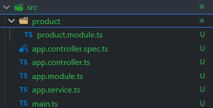
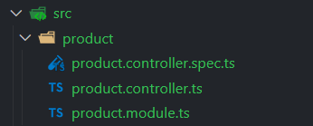

# NestJS Tutorial

Bu repo NestJs için çıkarmış olduğum notları ve örnek kodları barındırır. Basic yapıları anlamak ve kullanmak için roadmap niteliği taşımaktadır. Aşağıda yer alan notlar için https://www.youtube.com/@SakuraDev youtube kanalından yardım aldım.

## NestJS Nedir?

NestJS, `Node.js` üzerine inşa edilmiş, `TypeScript` destekli bir `backend framework`'tür. Modüler yapısı ve `dependency injection` desteği ile test edilebilir, ölçeklenebilir ve bakımı kolay uygulamalar geliştirilmesini sağlar. NestJS, hem `Object-Oriented Programming (OOP)` hem de `Functional Programming (FP)` paradigmalarını destekler.

## NestJS'in Mantığı ve Yapısı

NestJS, `Angular`'dan esinlenmiştir ve bu nedenle benzer bir modüler yapıya sahiptir. Controller, Service, Module ve Provider gibi kavramlar NestJS'in temel yapı taşlarıdır:

- Controller: İstekleri yönetir ve doğru servislere yönlendirir. API uç noktalarının tanımlandığı yerdir.

- Service: İş mantığını barındırır ve veritabanı ya da diğer harici kaynaklarla iletişim kurar.

- Module: Belirli bir işleve sahip olan ve ilgili bileşenleri gruplandıran yapılardır. Her uygulamanın en az bir AppModule'ü bulunur.

- Provider: Uygulama genelinde kullanılabilir hizmetlerdir ve Dependency Injection (DI) ile bağlanır.

## 1. Controller Tanımı

Controller'lar endpoint'leri yönettiğimiz kısımdır. Örnek bir Controller tanımı:

```js

@Controller('user')
export class AppController {
  constructor(private readonly appService: AppService) {}

  @Get('hello')
  getHello(): string {
    return this.appService.getHello();
  }
}

```

Yukarıdaki örnekte istek yolu şu şekildedir: http://localhost:3000/user/hello

## 2. İlk Controller Örneği

Buradaki örneğimizde bir product için controller tanımı yapılacak. Örnek şu endpoint'leri içeriyor:

- GET - product/all
- GET - product/:id
- POST - product/:id
- PUT - product/:id
- DELETE - prodcut/:id

Yapmamız gereken öncelikle bir module oluşturmak. Her uygulama en az bir module içerir. Bir modul oluşturmak için nestjs'in CLI'ı kullanılabilir. Aşağıdaki kod bir tane product modul'ü oluşturur:

`nest g module product`



Bu işlen sonucunda konsolda şu çıktıları alırız:

```c
CREATE src/product/product.module.ts (88 bytes)
UPDATE src/app.module.ts (330 bytes)
```

app.module.ts dosyamızda şu değişikliğin olduğunu görebiliriz:

```js
import { Module } from '@nestjs/common';
import { AppController } from './app.controller';
import { AppService } from './app.service';
import { ProductModule } from './product/product.module';

@Module({
  imports: [ProductModule], //modüllerimiz
  controllers: [AppController], // contorller'larımız
  providers: [AppService], // servislerimiz
})
export class AppModule {}
```

Şimdi de bir tane product için controller oluşturalım. Bunun için yine nestjs CLI kullanabiliriz. Aşağıdaki kod product için product klasörü altına contorller oluşturur.

`nest g controller product`



Controller CRUD işlemleri için endpoint'leri yazdığımız kısımdır.

İlk request endpoint'imizi yazalım:

```js
import { Controller, Get } from '@nestjs/common';

@Controller('product')
export class ProductController {
  @Get('all')
  findAll() {
    return 'All Products Returned';
  }
}
```

`/product/all` endpointine istek atılırsa ekranda return edilen mesaj yazar. Veri tabanından veri çekme işlemleri, ekleme, silme gibi işlemler için farklı metotlar ve fonksiyoneliteler tanımlanabilir.

### Route Parameters

Silme, güncelleme veya bulma işlemleri için istek urlinde paramtere olarak bazı verileri sunucuya gönderebiliriz. Örneğin;

```js
@Controller('product')
export class ProductController {
  @Get('all')
  findAll() {
    //the database
    return 'All Products Returned';
  }

  @Get(':id')
  findOne(@Param('id') id: string) {
    return `One Product Returned. Product ID: ${id}`;
  }
}

```

Örnekte id paramteresini kullandık. Eğer bu endpoint'e istek giderse ekranda return edilen mesaj yazacaktır: `product/2`, `product/13`

Birden fazla paramtre kullanmak istersek de şu şekilde yazmamız yeterli olacaktır:

```js
@Controller('product')
export class ProductController {
  @Get('all')
  findAll() {
    //the database
    return 'All Products Returned';
  }

  @Get(':id/:ref')
  findOne(@Param('id') id: string, @Param('ref') ref:string) {
    return `One Product Returned. Product ID: ${id} and Refernce: ${ref}`;
  }
}
```

Aynı mantıkta: `product/3/453323`, `product/4/277477`.

### Request Body

Frontend tarafından sunucuya veri gönderilmek istenirse bu verilere request'in `body` değerinde erişilir. Örneğin istemci tarafından gönderin bir JSON nesnesine nasıl erişildiğine bakalım:

```json
{
  "name": "Product Name",
  "price": 12345
}
```

Sunucu tarafı şu şekilde tanımlanmalı:

```js

@Controller('product')
export class ProductController {
  @Get('all')
  findAll() {
    //the database
    return 'All Products Returned';
  }

  @Get(':id/:slug')
  findOne(@Param('id') id: string, @Param('slug') slug: string) {
    return `One Product Returned. Product ID: ${id}, Other Parameter: ${slug}`;
  }

  @Post('create')
  createProduct(@Body() body) {
    return body;
  }
}

```

Eğer `product/create` endpoint'ine istek atılırsa body nesnesini dönecektir.

## Validators

İstemci tarafından gelecek olan veriler için (body, request, params gibi) sunucu tarafında güvenlik önlemleri almak gerekebilir. Type checking veya leng controll gibi özellikler sayesinde güvenli işlemler gerçekleşir. Bu işlem için Nestjs'de validator özellikleri vardır.

Aşağıdaki örnekleri inceleyelim:

### Params Validator

Örneğimizde id değerinin type değerini konsola yazdıracak olarak params değerinin daima string yazdıracaktır. Fakat id değerimiz daima number dönsün isteyebiliriz. Bunun için `Parser` kullanılabilir:

```js
  @Get(':id')
  findOne(@Param('id', ParseIntPipe) id: string) {
    return `One Product Returned. Product ID: ${id}`;
  }
```

Eğer `/product/12` endpoint'ine istek atılırsa return edilen değeri görürüz. Ancak `/product/jkj` gibi bir endpoint'e istek atarsak response olarka aşağıdaki error mesajını alırız:

```json
{
  "message": "Validation failed (numeric string is expected)",
  "error": "Bad Request",
  "statusCode": 400
}
```

Aynı işlemi query için yapacak olursak:

```js
  @Get(':id/')
  findOne(@Param('id', ParseIntPipe) id, @Query('sort', ParseBoolPipe) sort) {
    return `One Product Returned. Product ID: ${id} and sort: ${sort}`;
  }
```

Hatalı bir sorgu örneği : `/product/jkj?sort=543`

### Class Validation

İstemciden alacağımız body nesnesi için de validation yazabiliriz. Bunun için öncelikle `product` klasörü altında bir dto adında bir klasör oluşturalım oluşturalım. DTO, verilerin ağ üzerinden nasıl gönderileceğini tanımlayan bir nesnedir (Nestjs Documantation). DTO kasörü altında tanımlayacağımız dosyalar basit TypeSript şemalarıdır (class değerleri de denebilir). dto klasörü altında `productDto.dto.ts` adında bir dosya oluşturalım ve aşağıdaki örneği oluşturalım:

```js
import { IsBoolean, IsNumber, IsString } from 'class-validator';

export class CreateProductDto {
  name: string;
  price: number;
  isSelled: boolean;
}
```

Tek başına değerlerin type değerlerini kullanmak yetmez. Yapmak istediğimiz şey şu:

Eğer istemci tarafından bu veri şemasına uyan türde veri gönderilmez ise response olarak bir hata fırlatmak. Bu hataları tanımlamak için projemize aşağıdaki iki kütüphaneyi indirebiliriz:

`npm i class-validator class-transformer`

class-validator kütüphanesi class seviyesinde validation işlemi yapmamızı sağlıyor. productDto.dto.ts dosyamızı aşağıdaki kod ile değiştirelim:

```js
  import { IsBoolean, IsNumber, IsString } from 'class-validator';

  export class CreateProductDto {
    @IsString()
    name: string;
    @IsInt()
    price: number;
    @IsBoolean()
    isSelled: boolean;
  }
```

name değerimiz daima string, price değerimiz daima number ve isSelled değerimiz daima boolean olmalı.

Daha sonra product.controller.ts dosyamızda da bazı değişiklikler yapmamız gerekiyor:

Örneğimizi şu şekilde kurguladık:
Kullanıcı bir ürün eklemek isterse `/product/create` endpoint'ine POST isteği atmalı:

```js
  import {
    Body,
    Controller,
    Get,
    Param,
    ParseBoolPipe,
    ParseIntPipe,
    Post,
    Query,
    UsePipes,
    ValidationPipe,
  } from '@nestjs/common';

  import { CreateProductDto } from './dto/createProduct.dto';
  @Post('create')
  @UsePipes(new ValidationPipe())
  createProduct(@Body() body: CreateProductDto) {
    return body;
  }
```

UsePipes ile custom bir ValidationPipe oluşturuyoruz. Daha sonra body nesnesinin türünü product.dto.ts içerisinde oluşturmuş olduğumuz CreateProductDto class değeri ile eşliyoruz.
Aşağıdaki örnek üzerinden bir istek atarsak alacağımız hata response değerini görelim:

örnek body nesnesi:

```json
{
  "name": 3979,
  "price": "12344",
  "isSelled": "false33",
  "tst": false
}
```

hata mesajı:

```json
{
  "message": [
    "property tst should not exist",
    "name must be a string",
    "price must be a number conforming to the specified constraints",
    "isSelled must be a boolean value"
  ],
  "error": "Bad Request",
  "statusCode": 400
}
```

Görüldüğü üzere artık body için bir validation tanımalamsı yapmış olduk. Fakat örnek body'de `tst:false` olarak tanımlı bir satır olmasına rağmen hata mesajında buna dair bir ibare yok. Bunun sebebi default olarak tanımladığımız validator bu satırı görmezden gelir. Fakat bu TypeScript mantığına aykıdırıd. Bunun için yapmamız gereken controller kodunu şu şekilde güncellemektir:

```js
  import {
    Body,
    Controller,
    Get,
    Param,
    ParseBoolPipe,
    ParseIntPipe,
    Post,
    Query,
    UsePipes,
    ValidationPipe,
  } from '@nestjs/common';

  import { CreateProductDto } from './dto/createProduct.dto';
  @Post('create')
  @UsePipes(new ValidationPipe({ whitelist: true, forbidNonWhitelisted: true }))
  createProduct(@Body() body: CreateProductDto) {
    return body;
  }
```

`whitelist: true`: Bu sadece product.dto.ts dosyasında tanımladığımız türde verileri kabul eder ve işler. Onun dışında gönderilmiş olan verileri görmezden gelir, hata mesajı dönmez.

`forbidNonWhitelisted: true`: whitelist ile birlikte kullanılır ve product.dto.ts içerisinde tanımlı olmayan türde bir veri gönderilmesi durumunda hata mesajı gönderir:

```json
{
  "message": ["property tst should not exist"],
  "error": "Bad Request",
  "statusCode": 400
}
```

UsePipe kullanmak yerine validation tanımı `@Body` içerisinde de yapılabilir:

```js
...

@Post('create')
  createProduct(
    @Body(new ValidationPipe({ whitelist: true, forbidNonWhitelisted: true }))
    body: CreateProductDto,
  ) {
    return body;
  }

...
```

Daha detaylı validation işlemleri için validation tanımlamalarını şu şekilde ayarlamak mümkün:

```js
import { IsBoolean, IsInt, IsPositive, IsString } from 'class-validator';

export class CreateProductDto {
  @IsString({ message: 'name must be string (custom message)' })
  name: string;
  @IsInt({ message: 'price must be number (custom message)' })
  @IsPositive({ message: 'price must be positive' })
  price: number;
  @IsBoolean()
  isSelled: boolean;
}

```

validation içerisinde custom message tanımlamak da mümkündür. Eğer default error message'lar kullanılmak istenmez ise buraya custom message'lar da yazılabilir.

### Global and Model Level Validation

Validation tanımalamasını tüm endpoint'ler için kullanılabilir kılmanın yolu her body içerisinde `new ValidationPipe({ whitelist: true, forbidNonWhitelisted: true })` tanımlamasını kullanarak gerçekleştirilebilir. Fakat bunun yerine global olarak bu tanımlamayı yapabiliriz.
`main.ts` dosyasında bu tanımlama yapılabilir:

```js

```

Eğer her modele özgü bir validation tanımlamak istersek de (örneğin product route için) `product.module.ts` dosyasında validation tanımlaması yapabiliriz. main.ts dosyasında tanımladığımız validation işlemi tüm endpoint'ler için geçerlidir. Fakat model'de tanımladığımız validation işlemleri sadece o modelde tanımlı endpoint için geçerlidir. Tanımlala işlemi şu şekilde yapılabilir:

```js
import { Module, ValidationPipe } from '@nestjs/common';
import { ProductController } from './product.controller';
import { APP_PIPE } from '@nestjs/core';

@Module({
  controllers: [ProductController],
  providers: [
    {
      provide: APP_PIPE,
      useValue: new ValidationPipe({
        whitelist: true,
        forbidNonWhitelisted: true,
      }),
    },
  ],
})
export class ProductModule {}
```

Eğer ValidationPipe için bir property tanımlamak istiyorsan yukarıdaki gibi `useValue` kullanman gerekiyor. Burada whiteList ve forbidNonWhiteListed gibi ayarlamaları kullanmak mümkün. Fakat bu ayarlamları yapmadan kullanmak istiyorusan da `useClass` kullanabilirsin:

```js
import { Module, ValidationPipe } from '@nestjs/common';
import { ProductController } from './product.controller';
import { APP_PIPE } from '@nestjs/core';

@Module({
  controllers: [ProductController],
  providers: [
    {
      provide: APP_PIPE,
      useClass: ValidationPipe,
    },
  ],
})
export class ProductModule {}
```

### Custom Validation for Params and Query

Body için tanımladığımız validation özelliklerini params ve search query için de tanımlayabilirz. `dto` klasörü altında idParamDto.dto.ts adında bir dosya oluşturalım. Burada class validation ayarlamalarını yapacağız:

```ts
import { IsInt, IsPositive } from 'class-validator';

export class IdParamDTO {
  @IsInt({ message: 'id must be integer number' })
  @IsPositive({ message: 'id must be positive' })
  id: number;
}
```

Daha sonra örneğin findOne için kullanmış olduğumuz `id` params'ına bu validation değerini tanımlayalım:

```ts
  @Get(':id')
  findOne(@Param('id') id: IdParamDTO) {
    return `One Product Returned. Product ID: ${id}`;
  }
```

Eğer `/product/23` yoluna istek atarsak çıktı olarak şu değeri alacağızdır:

```json
{
  "message": ["id must be positive", "id must be integer number"],
  "error": "Bad Request",
  "statusCode": 400
}
```

Hata almamızın nedeni URL değerinden gelen params değerinin string type değerinde olmasıdır. Bunu console.log(type id) ile test edebilirsiniz. Bu hatanın gitmesi için `product.module` dosyasında belirli ayarlamaları yapmamız gerekmektedir:

```js
import { Module, ValidationPipe } from '@nestjs/common';
import { ProductController } from './product.controller';
import { APP_PIPE } from '@nestjs/core';

@Module({
  controllers: [ProductController],
  providers: [
    {
      provide: APP_PIPE,
      useValue: new ValidationPipe({
        whitelist: true,
        forbidNonWhitelisted: true,
        transform: true,
        transformOptions: {
          enableImplicitConversion: true,
        },
      }),
    },
  ],
})
export class ProductModule {}
```

`product.module.ts` dosyasının görünümü yukarıdaki gibidir. Burada iki tane ayarlama ekledik:

`transform:true`: Bu ayar transform (dönüşüm) yapmasını sağlar. URL'den gelen paramtre ve query değerlerinin transform edildiğini varsayar.

`enableImplicitConversion: true`: string olan bir ilkel görürse (boolean veya sayı gibi) @Type(() => Number) veya @Type(() => Boolean) kullanılmamış olsa bile bunun yerine ilkel tür olması gerektiğini varsaymasını ve dönüştürmesini söyleyecektir. (stackoverflow)

Bu ayarlamayı yaptıktan sonra halen daha aynı hatayı aldığımı farkettim. Bu hatayı da contorller içerisindeki id tanımlamasını şu şekilde yaptıktan sonra çözdüm:

```ts
  @Get(':id')
  findOne(@Param() params: IdParamDTO) {
    return params.id;
  }
```

Burada `@Param()` içinde önceki gibi `'id'` tanımlamasını kaldırdım. Eğer koyarsam halen daha hata almaya devam ettim. Eğer sadece id üzerinden almak istersem tanımalayı destructure edebilirim:

```ts
  @Get(':id')
  findOne(@Param() { id }: IdParamDTO) {
    return params.id;
  }
```

### Access Headers

NestJs'de request'in `Headers` 'ına erişmek için aşağıdaki kodu kullanman yeterli olacaktır:

```ts
  @Get(':id')
  findOne(@Param() params: IdParamDTO, @Headers() headers) {
    return headers;
  }

```

Return edilen değer:

```json
{
  "user-agent": "Apidog/1.0.0 (https://apidog.com)",
  "accept": "*/*",
  "host": "localhost:3000",
  "accept-encoding": "gzip, deflate, br",
  "connection": "keep-alive"
}
```

Olacaktır.

### Headers Validation

Daha sonra yazılacak...

### Dependency Injection ()
