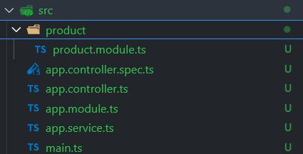
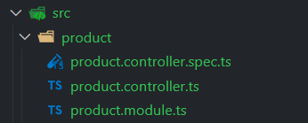

## NestJS Nedir?

NestJS, `Node.js` üzerine inşa edilmiş, `TypeScript` destekli bir `backend framework`'tür. Modüler yapısı ve `dependency injection` desteği ile test edilebilir, ölçeklenebilir ve bakımı kolay uygulamalar geliştirilmesini sağlar. NestJS, hem `Object-Oriented Programming (OOP)` hem de `Functional Programming (FP)` paradigmalarını destekler.

## NestJS'in Mantığı ve Yapısı

NestJS, `Angular`'dan esinlenmiştir ve bu nedenle benzer bir modüler yapıya sahiptir. Controller, Service, Module ve Provider gibi kavramlar NestJS'in temel yapı taşlarıdır:

- Controller: İstekleri yönetir ve doğru servislere yönlendirir. API uç noktalarının tanımlandığı yerdir.

- Service: İş mantığını barındırır ve veritabanı ya da diğer harici kaynaklarla iletişim kurar.

- Module: Belirli bir işleve sahip olan ve ilgili bileşenleri gruplandıran yapılardır. Her uygulamanın en az bir AppModule'ü bulunur.

- Provider: Uygulama genelinde kullanılabilir hizmetlerdir ve Dependency Injection (DI) ile bağlanır.

## 1. Controller Tanımı

Controller'lar endpoint'leri yönettiğimiz kısımdır. Örnek bir Controller tanımı:

```js

@Controller('user')
export class AppController {
  constructor(private readonly appService: AppService) {}

  @Get('hello')
  getHello(): string {
    return this.appService.getHello();
  }
}

```

Yukarıdaki örnekte istek yolu şu şekildedir: http://localhost:3000/user/hello

## 2. İlk Controller Örneği

Buradaki örneğimizde bir product için controller tanımı yapılacak. Örnek şu endpoint'leri içeriyor:

- GET - product/all
- GET - product/:id
- POST - product/:id
- PUT - product/:id
- DELETE - prodcut/:id

Yapmamız gereken öncelikle bir module oluşturmak. Her uygulama en az bir module içerir. Bir modul oluşturmak için nestjs'in CLI'ı kullanılabilir. Aşağıdaki kod bir tane product modul'ü oluşturur:

`nest g module product`



Bu işlen sonucunda konsolda şu çıktıları alırız:

```c
CREATE src/product/product.module.ts (88 bytes)
UPDATE src/app.module.ts (330 bytes)
```

app.module.ts dosyamızda şu değişikliğin olduğunu görebiliriz:

```js
import { Module } from '@nestjs/common';
import { AppController } from './app.controller';
import { AppService } from './app.service';
import { ProductModule } from './product/product.module';

@Module({
  imports: [ProductModule], //modüllerimiz
  controllers: [AppController], // contorller'larımız
  providers: [AppService], // servislerimiz
})
export class AppModule {}
```

Şimdi de bir tane product için controller oluşturalım. Bunun için yine nestjs CLI kullanabiliriz. Aşağıdaki kod product için product klasörü altına contorller oluşturur.

`nest g controller product`



Controller CRUD işlemleri için endpoint'leri yazdığımız kısımdır.

İlk request endpoint'imizi yazalım:

```js
import { Controller, Get } from '@nestjs/common';

@Controller('product')
export class ProductController {
  @Get('all')
  findAll() {
    return 'All Products Returned';
  }
}
```

`/product/all` endpointine istek atılırsa ekranda return edilen mesaj yazar. Veri tabanından veri çekme işlemleri, ekleme, silme gibi işlemler için farklı metotlar ve fonksiyoneliteler tanımlanabilir.

### Route Parameters

Silme, güncelleme veya bulma işlemleri için istek urlinde paramtere olarak bazı verileri sunucuya gönderebiliriz. Örneğin;

```js
@Controller('product')
export class ProductController {
  @Get('all')
  findAll() {
    //the database
    return 'All Products Returned';
  }

  @Get(':id')
  findOne(@Param('id') id: string) {
    return `One Product Returned. Product ID: ${id}`;
  }
}

```

Örnekte id paramteresini kullandık. Eğer bu endpoint'e istek giderse ekranda return edilen mesaj yazacaktır: `product/2`, `product/13`

Birden fazla paramtre kullanmak istersek de şu şekilde yazmamız yeterli olacaktır:

```js
@Controller('product')
export class ProductController {
  @Get('all')
  findAll() {
    //the database
    return 'All Products Returned';
  }

  @Get(':id/:ref')
  findOne(@Param('id') id: string, @Param('ref') ref:string) {
    return `One Product Returned. Product ID: ${id} and Refernce: ${ref}`;
  }
}
```

Aynı mantıkta: `product/3/453323`, `product/4/277477`.

### Request Body

Frontend tarafından sunucuya veri gönderilmek istenirse bu verilere request'in `body` değerinde erişilir. Örneğin istemci tarafından gönderin bir JSON nesnesine nasıl erişildiğine bakalım:

```json
{
  "name": "Product Name",
  "price": 12345
}
```

Sunucu tarafı şu şekilde tanımlanmalı:

```js

@Controller('product')
export class ProductController {
  @Get('all')
  findAll() {
    //the database
    return 'All Products Returned';
  }

  @Get(':id/:slug')
  findOne(@Param('id') id: string, @Param('slug') slug: string) {
    return `One Product Returned. Product ID: ${id}, Other Parameter: ${slug}`;
  }

  @Post('create')
  createProduct(@Body() body) {
    return body;
  }
}

```

Eğer `product/create` endpoint'ine istek atılırsa body nesnesini dönecektir.
